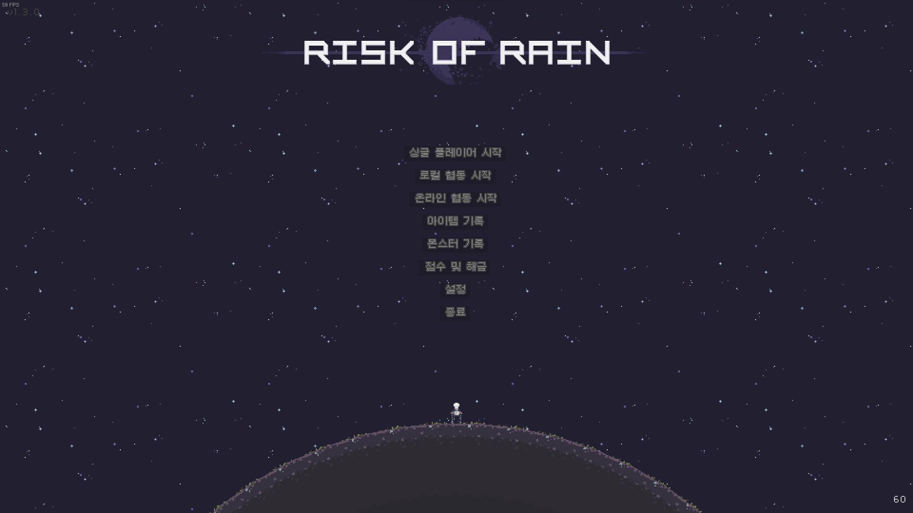
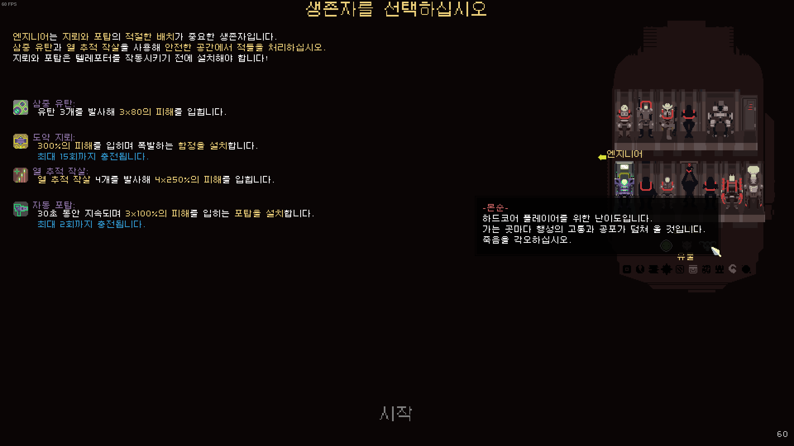

  

  # RoRKorean

  Risk of Rain 한국어화 패쳐

  

## 사용 방법

 1. [releases](https://github.com/dvrp0/RoRKorean/releases)에서 `RoRKoreanPatcher.zip` 파일 다운로드
 2. 압축 해제하고 `RoRKoreanPatcher.exe` 실행

### 오류 발생 시

패치가 정상적으로 진행되지 않는다면

 1. 위 이미지처럼 스팀 라이브러리에서 Risk of Rain을 우클릭하고 `로컬 파일 보기`를 클릭해 게임 경로 열기
 2. 다운로드된 `data.win` 파일을 해당 경로로 옮겨 덮어씌우기
 3. 만약 `data.win` 파일이 다운로드되지 않았다면 [여기](https://github.com/dvrp0/RoRKorean/raw/main/data.win)를 눌러 다운로드

## 스크린샷

## 기타
문제가 있다면 [이슈](https://github.com/dvrp0/RoRKorean/issues) 남겨주시면 감사하겠습니다 👍

## TODO
 - [ ] 로그북 번역
 - [x] 생존자 번역
 - [x] 아이템 번역
 - [x] UI 번역
 - [x] 대사 번역
 - [x] 스프라이트 번역
