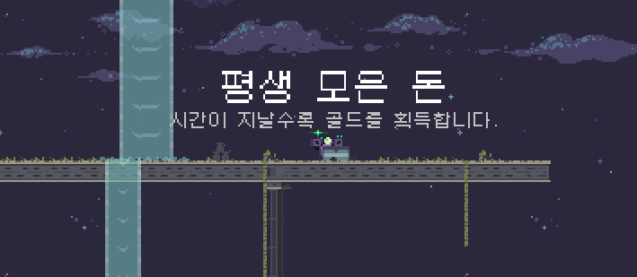

  

  # RoRKorean

  Risk of Rain 한국어화 패쳐

  

## 사용 방법

 1. [releases](https://github.com/dvrp0/RoRKorean/releases)에서 `.zip` 파일 다운로드
 2. 압축 해제하고 `RoRKoreanPatcher.exe` 실행

## 스크린샷

## 기타
문제가 있다면 [이슈](https://github.com/dvrp0/RoRKorean/issues) 남겨주시면 감사하겠습니다 👍

## TODO
 - [ ] 로그북 번역
 - [x] 생존자 번역
 - [x] 아이템 번역
 - [x] UI 번역
 - [x] 대사 번역
 - [x] 스프라이트 번역
